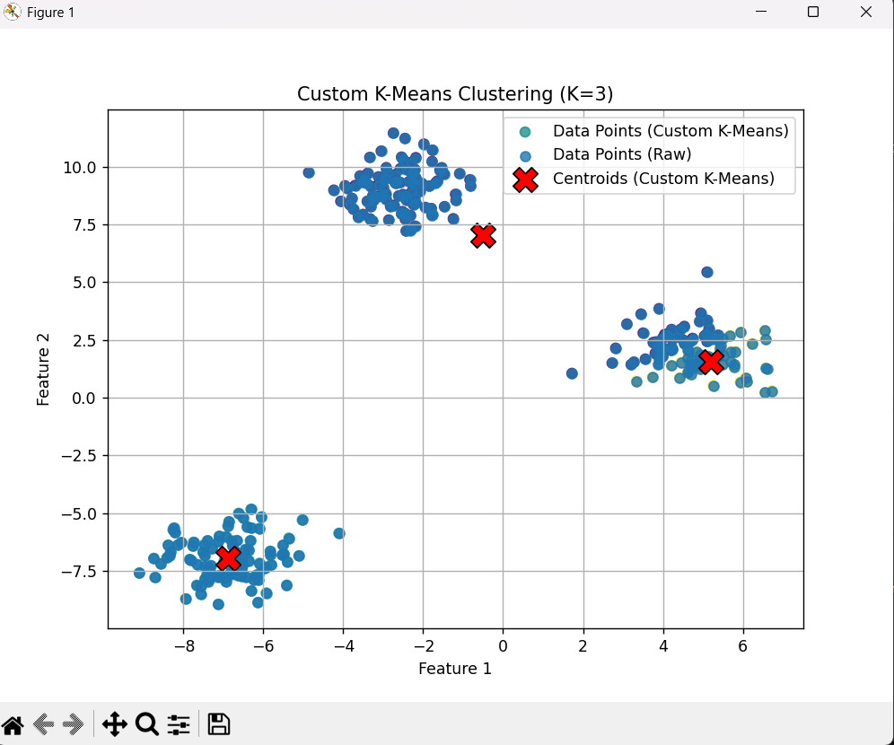

# K-Means Clustering from Scratch

## Description

This project implements the K-Means clustering algorithm from scratch in Python using NumPy for numerical operations and Matplotlib for visualization.

This project demonstrates a from-scratch implementation of the K-Means clustering algorithm using Python, NumPy for numerical operations, and Matplotlib for visualization. It covers the core iterative process of centroid initialization, cluster assignment, and centroid recalculation.

## Features Implemented

* **Core K-Means Algorithm:**
  * Iterative cluster assignment based on Euclidean distance to centroids.
  * Centroid recalculation as the mean of assigned data points.
  * Convergence check based on centroid movement (stops if centroids no longer change significantly or `max_iters` is reached).
* **Centroid Initialization Strategies:**
  * **`random_points` (Forgy method):** Initializes centroids by randomly selecting K data points from the dataset. (This is the default initialization method).
  * **`random_range`:** Initializes centroids by randomly sampling K points within the minimum and maximum range of each feature in the dataset.
  * **`kmeans++`:** A smarter initialization technique that aims to spread out initial centroids, often leading to better and more consistent clustering results.
* **Inertia Calculation:**
  * Computes the Within-Cluster Sum of Squares (WCSS), also known as inertia, to evaluate the compactness of the clustering.
* **Prediction:**
  * Ability to predict cluster assignments for new data points based on the fitted centroids.
* **Visualization:**
  * Includes a sample script (`sample_run_synthetic.py`) that generates synthetic 2D data, runs the custom K-Means algorithm, and visualizes the resulting clusters and final centroid positions.

## Tech Stack

* **Language:** Python
* **Libraries:**
  * NumPy: For numerical computations, array manipulations, and distance calculations.
  * Matplotlib: For visualizing the clusters and centroids.
  * Scikit-learn: Used *only* in the sample script (`sample_run_synthetic.py`) for generating synthetic blob data (`make_blobs`). The K-Means algorithm itself is implemented from scratch.

## File Structure

* `KMeansClustering.py`: Contains the `KMeansClustering` class with the core algorithm implementation.
* `sample_run_synthetic.py`: A script to demonstrate the K-Means algorithm on synthetically generated 2D data and visualize the output.
* `images/synthetic_data_visualize.png`: The plot generated by `sample_run_synthetic.py` showing the clustered data.

## Core Algorithm Steps

The K-Means algorithm implemented follows these iterative steps:

1. **Initialization:**
    * Choose the number of clusters, `K`.
    * Initialize `K` centroids using one of the specified methods (`random_points`, `random_range`, or `kmeans++`).
2. **Assignment Step:**
    * For each data point, calculate its Euclidean distance to all `K` centroids.
    * Assign the data point to the cluster of the centroid with the minimum distance.
3. **Update Step:**
    * For each cluster, recalculate its centroid as the mean of all data points assigned to that cluster.
4. **Convergence:**
    * Repeat steps 2 and 3 until the centroids no longer change significantly between iterations (within a defined tolerance) or a maximum number of iterations (`max_iters`) is reached.

## Handling Common Issues

During the development and implementation of K-Means, several common challenges were addressed:

* **Initial Centroid State:** The `_assign_clusters` and `_update_centroids` methods require centroids to be initialized. The `fit` method ensures `_initialize_centroids` is called first. Defensive checks are also present in helper methods to raise errors if centroids are `None`.
* **Centroid Updates:** The `_update_centroids` method ensures that `self.centroids` is correctly updated with the newly calculated mean positions for each cluster.
* **Convergence Detection:** The `fit` method compares centroid positions from the previous iteration to the current one using `np.all` to check for convergence (Note: `np.allclose` would be more robust for floating-point comparisons, as discussed during development).
* **Empty Clusters:** If a cluster becomes empty (no points assigned to it) during an update step, its centroid is re-initialized by selecting a random data point from the dataset. This prevents `NaN` values and gives the centroid a chance to attract points in subsequent iterations.
* **Reproducibility:** The `random_state` parameter, when set in the constructor, seeds NumPy's random number generator, ensuring that random processes like initial centroid selection (for `random_points` and `random_range`) and the first pick in `kmeans++` are deterministic.

## Visualization of Synthetic Data Clustering

The `sample_run_synthetic.py` script produces the following visualization when run on 2D synthetic data with K=3:

This plot shows the data points colored by their assigned cluster and the final positions of the K centroids marked by red 'X's.

## Future Improvements

* **Vectorization:** Further optimize distance calculations and update steps using more advanced NumPy broadcasting for potential performance gains on very large datasets.
* **`n_init` Parameter:** Implement an `n_init` parameter in the `fit` method. This would allow the algorithm to run multiple times with different random initializations (especially for `random_points` and `random_range` methods) and select the best clustering result (lowest inertia). This is a standard practice to mitigate the issue of K-Means converging to local optima.
* **Advanced Empty Cluster Handling:** Explore more sophisticated strategies for handling empty clusters beyond random re-initialization, such as assigning the centroid to the point furthest from any existing centroid.
* **Tolerance Parameter for Convergence:** Allow users to specify the tolerance (`tol`) for the convergence check (currently relies on exact equality for `np.all`, or `atol=1e-6` if `np.allclose` were used).
* **Robustness of `np.allclose` for Convergence:** While `np.all` was used in the final provided `fit` method for exact centroid equality, for floating-point numbers, `np.allclose` with a suitable tolerance (`atol`) is generally more robust for checking convergence and was discussed as a refinement.
